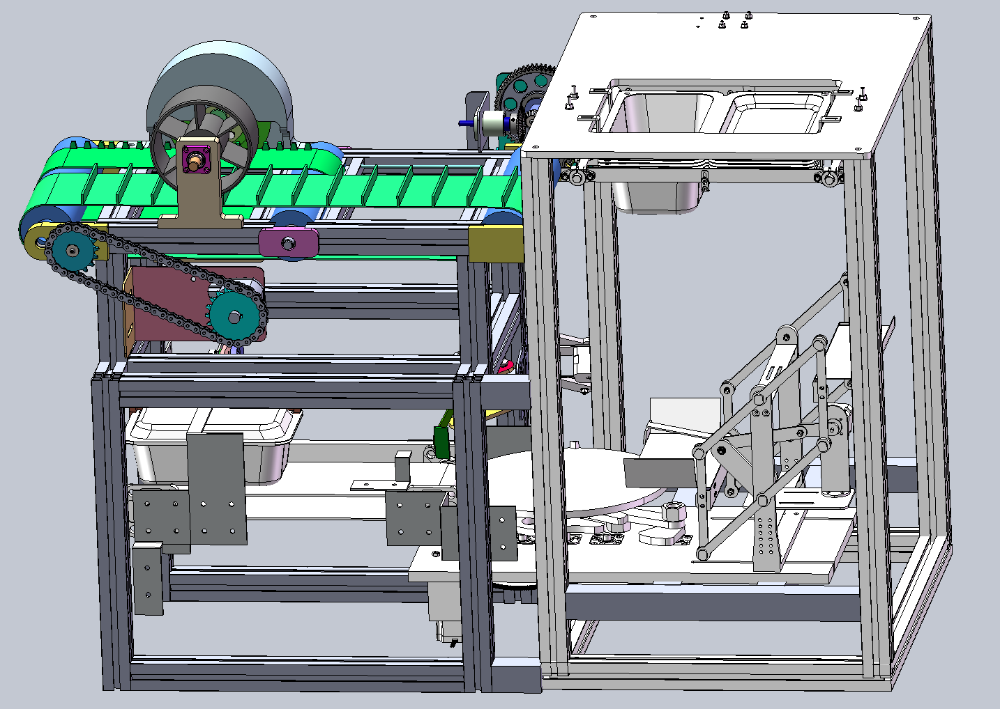
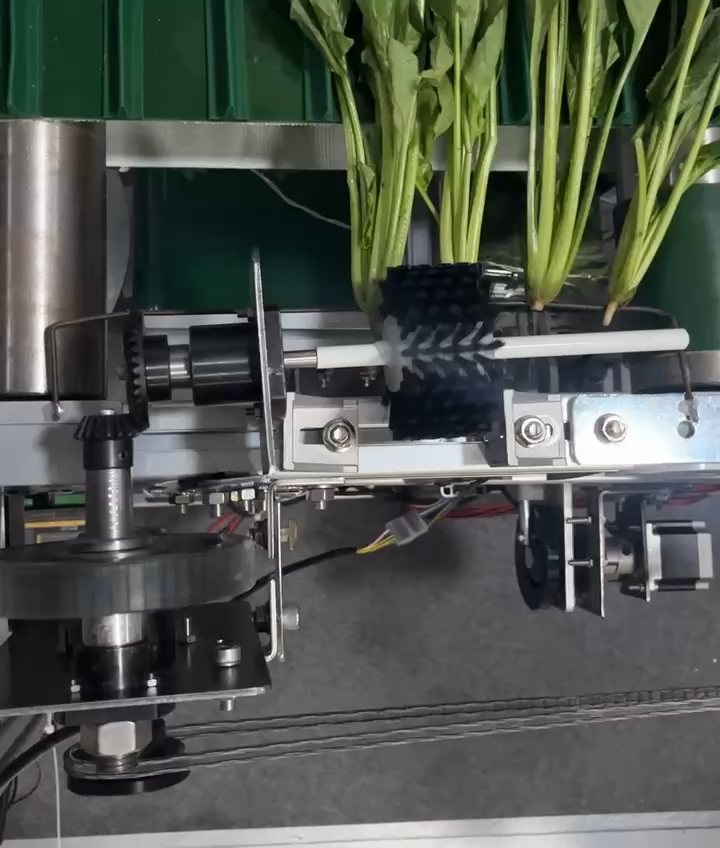
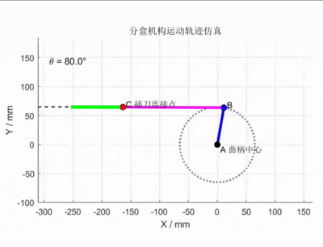
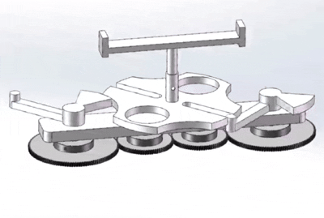
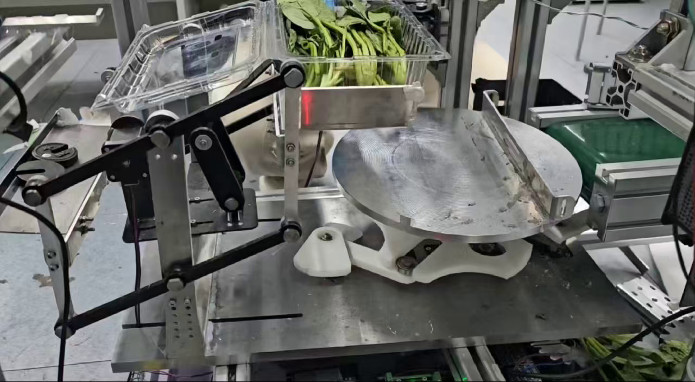
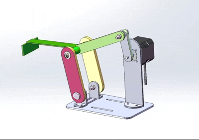
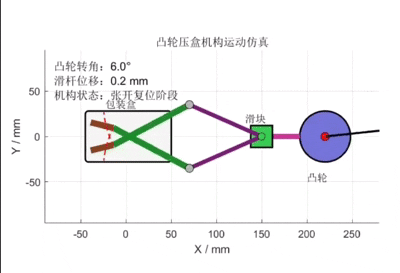
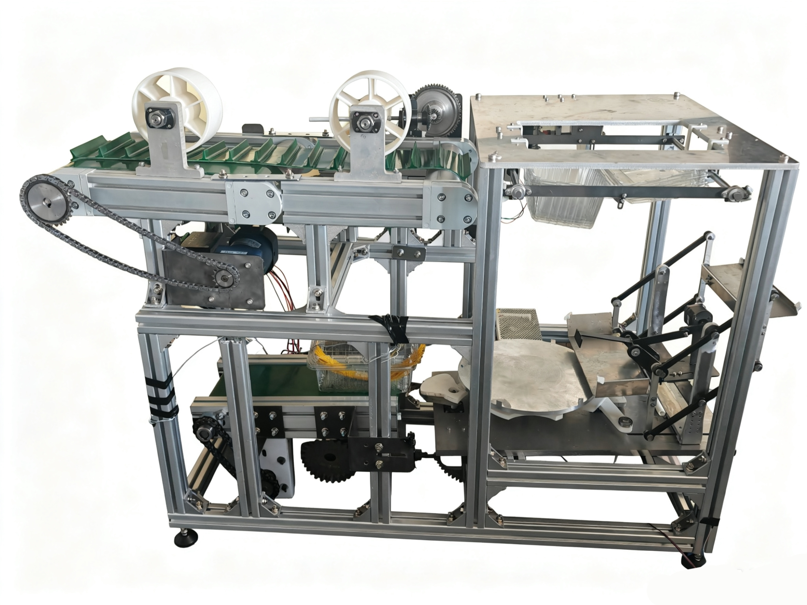

# Leafy Vegetable Cleaning and Packaging System

> **Root Trimming · Dry Cleaning · Box Separation · Mechanical Weighing · Intermittent Indexing · Packaging Transfer**

An integrated mechanical system for the preliminary cleaning, portioning, and packaging of leafy vegetables such as spinach.

The project combines six coordinated modules—root trimming and dry cleaning, box separation, mechanical weighing, 90° indexing, box transfer, and final pressing—into a compact processing line intended for small-scale agricultural processing and engineering education.

> **Repository status:** The STM32 motor-control firmware is open source under the MIT License and available in [`firmware/stm32f407-controller/`](firmware/stm32f407-controller/). MATLAB simulations, CAD/SolidWorks models, manufacturing drawings, and complete design documentation are not currently public.

---

## Project Overview

Leafy vegetables are commonly trimmed, cleaned, weighed, and packed by hand before entering supermarkets, community stores, or distribution centers. Manual processing can lead to inconsistent root length, cleanliness, package weight, and product orientation.

This project explores a compact, low-cost mechanical alternative. The design emphasizes reliable mechanism-level coordination, simple maintenance, and reduced dependence on pneumatic, hydraulic, and complex closed-loop control systems.

<p align="center">
  
</p>

<p align="center">
  <i>Integrated system architecture and major functional modules.</i>
</p>

---

## System Workflow

```text
Leafy Vegetables
       ↓
Constrained Feeding
       ↓
Root Trimming and Dry Brushing
       ↓
Automatic Box Separation
       ↓
Mechanical Weight-Threshold Detection
       ↓
Box Transfer
       ↓
90° Intermittent Indexing
       ↓
Secondary Transfer and Box Pressing
```

The machine coordinates two material flows:

- a **vegetable-processing line** for feeding, root trimming, and dry cleaning;
- a **package-handling line** for box separation, weighing, orientation, transfer, and pressing.

---

## Key Features

- Integrated processing from root preparation to packaged-box transfer
- Dry root-cleaning method that avoids a dedicated washing stage
- Periodic single-box separation from a stacked supply
- Roberval-type mechanical weighing with an adjustable threshold
- Symmetric Geneva mechanism for 90° intermittent indexing
- Four-bar transfer mechanism designed around an approximately straight output segment
- Standardized motors, gears, bearings, shafts, and aluminum profiles
- Modular architecture for fabrication, assembly, testing, and maintenance
- STM32F407-based coordinated control of six stepper channels, two continuous-rotation servos, two sensors, and two relay outputs
- Public STM32CubeMX and Keil MDK firmware project

---

# Embedded Motor Control

The integrated prototype is coordinated by an **STM32F407IGTx** controller. The competition firmware combines open-loop step/direction control, PWM servo control, proximity-sensor feedback, and relay-switched auxiliary actuators into a repeated processing sequence.

<p align="center">
  <strong>6 stepper channels · 2 PWM servo channels · 2 proximity sensors · 2 relay outputs</strong>
</p>

## Controller Architecture

```text
                         ┌── Step/Direction ──> Stepper Motors 1–6
STM32F407 Controller ────┼── TIM4 PWM ───────> Continuous Servos 1–2
                         ├── GPIO Inputs ─────> Proximity Sensors 1–2
                         └── GPIO Outputs ────> Relay Channels 1–2
```

The stepper channels use a shared pulse-generation routine with independently configured pulse periods. A motor command specifies direction, angle, and microstep subdivision; the controller converts the requested angle into a pulse count using a 1.8° full-step angle and 1/8 microstepping.

Two continuous-rotation servos are driven from TIM4 at 50 Hz. Their stop and direction commands use calibrated pulse widths around a 1.5 ms neutral point. Two active-low proximity inputs provide event-based progression at key stages, while two relay outputs switch auxiliary mechanisms.

## Main Execution Sequence

```text
Initialize outputs and stop all actuators
        ↓
Run Stepper 5 in two indexed movements
        ↓
Move Servo 1 outward
        ↓
Enable Relay 1 and run Stepper 4 until Sensor 1 triggers
        ↓
Disable Relay 1 and enable Relay 2
        ↓
Run Stepper 6, Stepper 1, and Stepper 2 in sequence
        ↓
Wait for Sensor 2, then disable Relay 2
        ↓
Run Stepper 3 forward and backward
        ↓
Execute Servo 2 forward/return action
        ↓
Return Stepper 1 and Servo 1
        ↓
Stop auxiliary outputs and repeat after a delay
```

The exact motor-to-mechanism wiring labels were not preserved in the source archive, so the public documentation retains the tested channel names (`Motor 1`–`Motor 6`) instead of inventing subsystem assignments.

## Firmware

The complete source project is available at [`firmware/stm32f407-controller/`](firmware/stm32f407-controller/). It includes:

- application and peripheral source under `Src/` and `Inc/`;
- the STM32CubeMX configuration file `STEEP.ioc`;
- the Keil MDK project and startup file;
- the required STM32F4 HAL and CMSIS sources with their original license notices.

See the [firmware documentation](firmware/stm32f407-controller/README.md) for the pin map, timing parameters, build instructions, control sequence, and prototype-safety limitations.

---

# Mechanical Design

## 1. Root Trimming and Dry Cleaning

The front-end module uses constrained belt feeding to guide leafy vegetables through two processing stations. A circular blade removes excess root material, while a rotating brush performs dry soil removal.

The transport and processing mechanisms use independent drives, allowing feed speed and cutting/brushing speed to be adjusted separately.

<p align="center">
  
</p>

The main design considerations include:

- lateral positioning of the vegetable stems;
- vertical support near the cutting and brushing zones;
- suppression of vibration through pressure rollers;
- independent speed adjustment for feeding and processing;
- reduced damage to leaves and stems.

---

## 2. Automatic Box Separation

Lightweight plastic boxes are supplied as a vertical stack and released one at a time. The mechanism converts rotary input into a controlled separating motion while supporting the remaining stack.

<p align="center">
  
</p>

---

## 3. Mechanical Weighing

A Roberval-type linkage is used for mechanical threshold detection. Its parallel-link structure helps the weighing platform remain approximately level as the load changes.

The mechanism is intended to determine whether the package has reached a target quantity rather than to replace a precision electronic scale.

---

## 4. 90° Intermittent Indexing

A symmetric Geneva mechanism rotates the package by 90° between two transfer directions. The intermittent motion provides a defined dwell interval for package entry and exit.

<p align="center">
  
</p>

<p align="center">
  
</p>

---

## 5. Box Transfer

Two transfer stages move the filled box through the weighing and indexing stations. A four-bar mechanism is configured so that the end-effector follows an approximately straight segment during the useful part of its trajectory.

<p align="center">
  
</p>

---

## 6. Box Pressing

The final module synchronizes box movement and pressing through a cam-driven linkage. The mechanism coordinates the pressing stroke with conveyor motion while maintaining a compact layout.

<p align="center">
  <a href="assets/videos/box-pressing.mp4?raw=1">
    
  </a>
</p>

<p align="center">
  <a href="assets/videos/box-pressing.mp4?raw=1"><strong>▶ Watch the box-pressing mechanism simulation (MP4)</strong></a>
</p>

---

# Physical Prototype

A physical prototype was assembled to evaluate module integration, mechanical timing, material transfer, and the accessibility of key adjustment points.

<p align="center">
  
</p>

The prototype supports engineering validation of:

- continuous material flow between modules;
- single-box release and positioning;
- mechanism timing and interference checks;
- package orientation and transfer;
- component accessibility and maintainability.

---

## Demonstration Video

The following video presents the integrated prototype, its principal mechanisms, and the overall operating process.

<p align="center">
  <a href="assets/videos/system-demonstration.mp4">
    
  </a>
</p>

<p align="center">
  <a href="assets/videos/system-demonstration.mp4"><strong>▶ Watch the system demonstration video</strong></a>
</p>

---

## Design Targets

| Item | Design target |
|---|---|
| Processing object | Spinach and similar lightweight leafy vegetables |
| Packaging | Stacked lightweight plastic boxes |
| Conveyor speed | Approximately 0.20 m/s |
| Indexing angle | 90° intermittent rotation |
| Weighing principle | Roberval linkage with adjustable counterweight |
| Transfer principle | Four-bar linkage using an approximately straight trajectory segment |
| Design emphasis | Low cost, limited control complexity, ease of fabrication and maintenance |

---

## Project Scope

This public repository presents the system concept, mechanical architecture, representative prototype images, and mechanism animations.

The following materials remain private at this stage:

- MATLAB mechanism-simulation source code;
- SolidWorks assemblies and part files;
- DWG, STEP, and manufacturing drawings;
- detailed calculations and complete design documentation;
- unpublished research and competition materials.

For academic discussion or collaboration, please contact the repository owner through GitHub.

---

## Acknowledgements

Developed by a student engineering team at **Beijing University of Technology** with faculty supervision.

The firmware under [`firmware/`](firmware/) is released under the [MIT License](firmware/LICENSE). Project documentation, images, videos, and mechanical-design materials remain all rights reserved unless otherwise stated.

